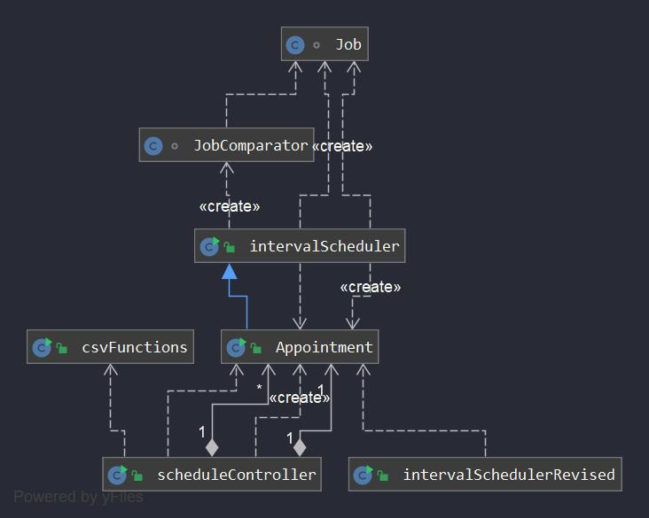

# TeeTimer

Engineering Entrepreneurship

A golf course scheduling application intended to regulate pace of play
and improve efficiency. Target market is local country clubs where golf
carts are equipped with standard GPS that record each golfers personal stats.

Currently the ideal way of purchasing would be packing our service with an exisinting PGA yearly fee.

# Resources

Java 8
JavaFx
Scene Builder

## Client Information

This product was produced under the supervision of John Lane who is a golf course manager at Quail Village Country Club.
He has over 20 years of experience in the field, and was a driving force for the direction our group took.

## Diagrams

## Future Plans

The product has potential as a great data collection tool other than the obvious shceduling benefits.
Possibly market a new app version that allows golfers too access personal data from any course they've
golfed at. This would give golfers an incentive to try different courses and compare statistics.
